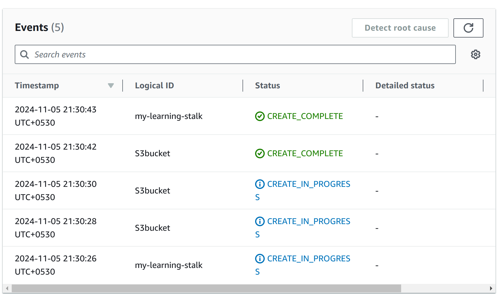

# Cloud Formation templates

- ## S3 with versioning

Cloud Formation Output

S3 bucket Details Page

- ## EC2 with key pair and subnet 

* Created a VPC with prpvided CIDR Range
* Created a subnet inide the vpc by dynamicaly passig the ref
* Created a security group inside the vpc
* Created EC2 instance with image, key, subnet, vpc etc

Cloud Formation Layout

Cloud Formation output

